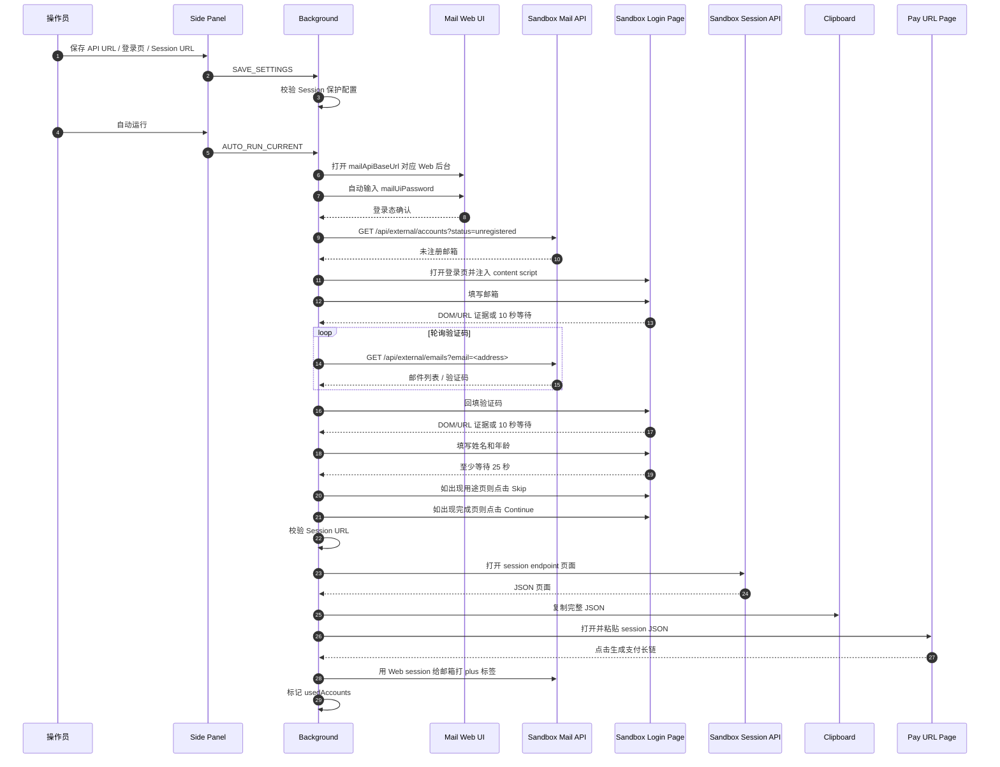
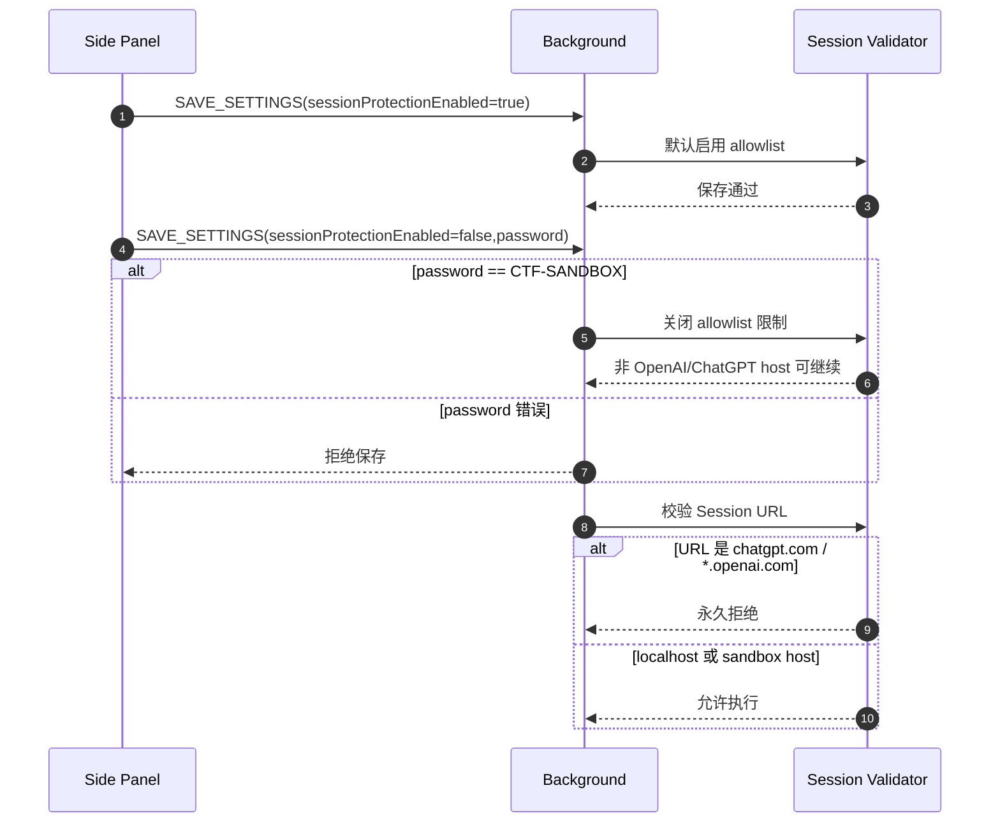

# Plus PP Helper

Chrome MV3 扩展，用于 CTF / competition sandbox 场景中的账号流程自动化。当前主流程只面向可配置的 sandbox/mock 目标：从邮箱 API 获取未注册邮箱、打开登录页、轮询并回填验证码、填写基础资料，最后读取 sandbox session endpoint，把 JSON 复制到剪贴板，并填入支付长链生成页。

本项目不会默认自动化真实 `chatgpt.com` / OpenAI 注册流程；如果 Session URL 指向真实 ChatGPT/OpenAI 域名，扩展会拒绝执行。

扩展首次加载时会自动打开一次 `https://gist.github.com/systemoutprintlnhelloworld/bd72f38ddd35e32b10f5ce8efc328bcc/raw/c97bfb561894cbff77e993c032e54a5ff387310a/paypal-autofiller.user.js`，打开成功后在 `chrome.storage.local` 记录标记，后续启动不会重复打开。

## 快速开始

1. 打开 `chrome://extensions/`
2. 开启“开发者模式”
3. 点击“加载已解压的扩展程序”
4. 选择当前项目目录
5. 打开扩展 Side Panel，填写配置并点击 `自动运行`

运行中如页面卡在邮箱填写或跳转阶段，可点击顶部 `快速中断`，扩展会立刻广播停止信号并把当前 running 步骤置为可重试状态。日志区的 `Stick end` 开关可控制刷新时是否始终滚动到底部。

## 必要配置

- `API Key`
  Sandbox 邮箱 API Key。
- `邮箱 API URL`
  邮箱服务地址，例如 `http://localhost:5000`。
- `邮箱后台登录`
  自动运行前会先打开 `邮箱 API URL` 对应的 Web 后台，例如 `http://localhost:5000/`。邮箱后台密码独立于 API Key，默认 `admini123`，扩展会自动输入并确认登录态。
- `登录页 URL`
  Sandbox 登录页，例如 `http://localhost:5000/auth/login`。
- `Session URL`
  Sandbox session JSON endpoint，例如 `http://localhost:5000/api/auth/session`。
- `Session 保护`
  默认开启。开启时，Session URL 只能是 localhost，或与登录页 / 邮箱 API 同 host 的 sandbox 地址。
- `关闭保护密码`
  如比赛环境必须访问另一个 sandbox host，可取消勾选 `Session 保护` 并输入 `CTF-SANDBOX` 保存。此操作只放宽 sandbox allowlist；真实 `chatgpt.com` / OpenAI 域仍会被拒绝。
- `默认姓名`
  基础资料页默认填写值，默认 `nicai`。
- `默认年龄`
  基础资料页默认填写值，默认 `25`。
- `轮询间隔 / 轮询超时`
  验证码邮件轮询参数。

## 自动流程

0. 打开邮箱 API URL 对应的邮箱后台页面，用独立邮箱后台密码自动登录并确认登录态
1. 从 sandbox 邮箱 API 获取一个未注册邮箱
2. 打开配置的 sandbox 登录页
3. 填写并提交邮箱，等待验证码页 DOM / URL 变化；未检测到变化时至少等待 10 秒
4. 轮询邮箱验证码并回填，等待资料页 DOM / URL 变化；未检测到变化时至少等待 10 秒
5. 填写基础资料后持续监控后续引导页：遇到 `What brings you to ChatGPT?` 立即点击 `Skip`，遇到 `You're all set` 立即点击 `Continue`；若页面暂未出现，保留最多 45 秒的自动观察窗口
6. 打开 session endpoint 页面，复制完整 session JSON
7. 打开 `https://payurl.ark2.cn/`，填入 `Access Token 或 session JSON` 文本框并点击生成支付长链

流程完成后会给当前邮箱打 `plus` 标签，并写入本地 `usedAccounts` 账本。后续选号会跳过已有 `plus`、`已注册` 或 `registered` 标签的账号。

## 时序图





## 手动调试

Side Panel 的“高级 / 手动调试”保留 7 个步骤按钮：

1. 获取未注册邮箱
2. 打开登录页
3. 填写邮箱
4. 邮箱验证码：取码 / 回填
5. 填写基础资料
6. 复制 Session JSON
7. 生成支付长链

手动跑完后可以点击 `完成流程`，会尝试给当前邮箱打 `plus` 标签并标记本地已用。

## Release 自动化

仓库包含 GitHub Actions 工作流 `.github/workflows/release.yml`。任意分支 push、tag push 或手动触发 workflow 后，都会运行测试、整理扩展文件，并产出：

- `plus-pp-helper.zip`
- `plus-pp-helper.crx`

分支 push 会创建 `auto-<run_number>` prerelease；tag push 会使用 tag 名创建正式 Release。如需稳定的 CRX extension id，在仓库 Secrets 中配置 `CRX_PRIVATE_KEY_B64`，内容为 CRX 私钥 PEM 的 base64。未配置时 workflow 会让 Chrome 临时生成打包密钥，适合测试发布。

## Sandbox 邮箱 API 兼容

默认账号接口为：

```text
GET {邮箱 API URL}/api/external/accounts?status=unregistered
```

默认邮件接口为：

```text
GET {邮箱 API URL}/api/external/emails?email=<address>&folder=all&top=10
```

账号响应支持以下常见形状：

```json
{ "accounts": [{ "email": "user@example.test" }] }
```

```json
{ "email": "user@example.test" }
```

邮件响应支持 `emails`、`mails`、`messages`、`items` 等数组字段，并会从邮件主题、正文或详情中提取 4-8 位验证码。

## 项目结构

```text
hotmail-register-extension/
├── background.js
├── manifest.json
├── content/
│   ├── sandbox-login-page.js
│   ├── signup-page.js
│   ├── vps-panel.js
│   └── utils.js
├── shared/
│   ├── sandbox-flow.js
│   ├── sandbox-mail-client.js
│   ├── sandbox-session.js
│   ├── verification-poller.js
│   └── ...
├── sidepanel/
│   ├── sidepanel.html
│   ├── sidepanel.css
│   └── sidepanel.js
├── tests/
└── docs/
```

## 测试

```bash
npm test
```
