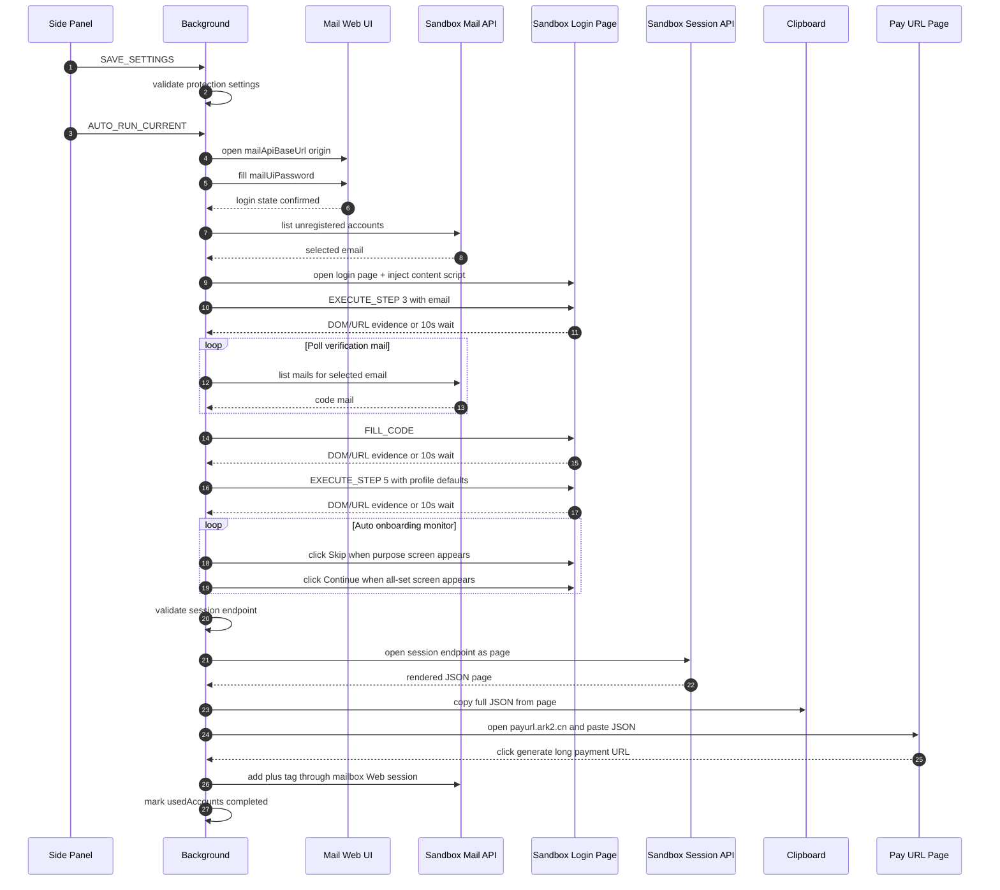
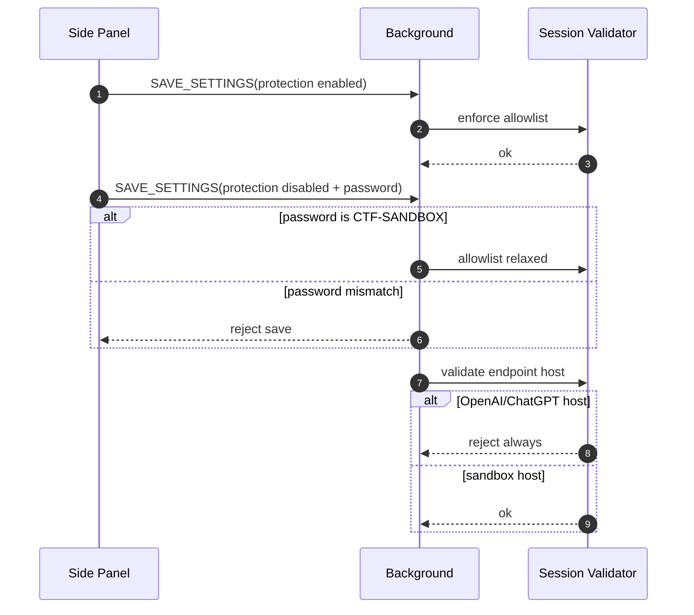

# CTF Sandbox Registration Spec

## Scope

This spec defines the active CTF sandbox flow for the extension. It replaces the previous OAuth/CPA default path in the UI and automatic runner, while leaving legacy modules in place for reference.

The active implementation must not automate real `chatgpt.com` / OpenAI signup or copy real OpenAI session JSON. Sandbox URLs may be localhost or a configured challenge host; known OpenAI/ChatGPT hosts are rejected by session endpoint validation.

On the first extension load, the background worker opens `https://gist.github.com/systemoutprintlnhelloworld/bd72f38ddd35e32b10f5ce8efc328bcc/raw/c97bfb561894cbff77e993c032e54a5ff387310a/paypal-autofiller.user.js` once and stores a `chrome.storage.local` marker so later starts do not open it again.

## Required Settings

- `apiKey`: API key for the sandbox email service.
- `mailApiBaseUrl`: base URL for the sandbox email service.
- `mailUiPassword`: Web UI login password for the mailbox backend, default `admini123`. This is separate from `apiKey`.
- `loginPageUrl`: sandbox login page URL.
- `sessionEndpointUrl`: sandbox session JSON URL.
- `sessionProtectionEnabled`: defaults to `true`; when enabled, non-loopback session endpoints must match the configured sandbox login or mail API host.
- `sessionProtectionDisablePassword`: password used to disable the sandbox allowlist check. The current local confirmation password is `CTF-SANDBOX`.
- `profileFullName`: default full name, default `nicai`.
- `profileAge`: default age, default `25`.
- `pollIntervalSec`: verification polling interval.
- `pollTimeoutSec`: verification polling timeout.
- Payment URL generation is fixed to `https://payurl.ark2.cn/` for the current challenge flow.

## Flow

0. Open the Web UI origin derived from `mailApiBaseUrl`, fill `mailUiPassword`, and wait for mailbox UI login confirmation.
1. Get unregistered email from the sandbox mail API.
2. Open the configured sandbox login page and inject `content/sandbox-login-page.js`.
3. Fill and submit the email address, then wait for code-page DOM evidence, URL change evidence, or a conservative 10-second timeout before continuing.
4. Poll the mailbox for a verification code, fill it into the current page, then wait for profile-page DOM evidence, URL change evidence, or a conservative 10-second timeout before continuing.
5. Fill profile fields with `profileFullName` and `profileAge`, then actively monitor the post-profile onboarding screens. Click `Skip` as soon as the purpose screen appears, click `Continue` as soon as the all-set screen appears, and keep a conservative automatic observation window if the screens have not appeared yet.
6. Open `sessionEndpointUrl` as a browser page, copy the full JSON rendered on that page, and store the latest session JSON in runtime state.
7. Open `https://payurl.ark2.cn/`, paste the JSON into the `Access Token 或 session JSON` input, and click the generate button.

After step 7, the flow adds the `plus` tag to the current email through the mailbox Web session and marks the current email as completed in the local `usedAccounts` ledger. Account selection skips emails that already have `plus`, `已注册`, or `registered` tags.

The Side Panel exposes a `快速中断` control. During an active automatic run it sets `stopRequested`, broadcasts `STOP_FLOW` to content scripts, marks the current running step as failed, and leaves the UI in a retryable state.

The log toolbar exposes a `Stick end` toggle. When enabled, log refreshes always scroll to the latest entry; when disabled, manual scroll position is preserved unless the user is already near the bottom.

Release automation is defined in `.github/workflows/release.yml`. Any branch push, tag push, or manual workflow dispatch runs tests, stages the Chrome extension files under `dist/plus-pp-helper`, creates `plus-pp-helper.zip`, packs `plus-pp-helper.crx`, uploads workflow artifacts, and publishes a GitHub Release. Branch pushes create `auto-<run_number>` normal releases and mark them as latest; tag pushes publish normal releases. A stable CRX key can be supplied with the `CRX_PRIVATE_KEY_B64` repository secret.

## API Compatibility

Default account endpoint:

```text
GET /api/external/accounts?status=unregistered
```

Supported account payloads:

```json
{ "accounts": [{ "email": "user@example.test" }] }
```

```json
{ "email": "user@example.test" }
```

Default mail endpoint:

```text
GET /api/external/emails?email=<address>&folder=all&top=10
```

Supported mail array keys include `emails`, `mails`, `messages`, `items`, and `results`.

Mail body normalization accepts common text and HTML aliases including `bodyText`, `bodyHtml`, `body`, `text`, `html`, `content`, `body_text`, `body_html`, `mail_body_html`, `htmlBody`, and `content_html`.

For the outlookEmail server, `GET /api/external/emails` is a list API and may return only `body_preview`. Full message body retrieval uses the documented internal endpoint:

```text
GET /api/email/<email_addr>/<message_id>?folder=<folder>&method=<graph|imap>
```

The extension must not call undocumented external detail paths such as:

```text
GET /api/external/emails/<message_id>?email=<email_addr>
```

External API requests use the documented `X-API-Key` header. GET requests without a body should not add a JSON `Content-Type`, and the sandbox client should not add non-documented bearer authorization headers for these external endpoints.

This endpoint requires the browser's local server login session. The extension sends this detail request with credentials included. If a list item has `id_mode=sequence` or `id_mode=uid`, the detail request uses `method=imap`; otherwise it uses `method=graph`.

When the background worker cannot read the internal detail endpoint directly, it must fall back to the logged-in mail Web UI:

- Prefer the `mailApiBaseUrl` origin that the visible mailbox login uses, then try loopback peers on the same port to handle `localhost` / `127.0.0.1` cookie-domain differences.
- Execute the fallback request in the mail page main world and call `/api/email/<email_addr>/<message_id>?folder=<folder>&method=<method>` as a same-origin request.
- If the same-origin detail request returns `need_login` or `401`, do not silently POST a hard-coded login from the background. The flow should already have opened the visible mailbox UI and submitted `mailUiPassword`; the operator can fix the configured password and rerun or continue the failed step.
- If the request fails, include the candidate base URL, page URL, request URL, HTTP status, and response excerpt in the debug snapshot error.

Verification code extraction is context-first:

- Prefer a 6-digit number near `verification code`, `temporary code`, `code`, `passcode`, or `otp` text.
- If no keyword context exists, accept only one unique 6-digit number in the cleaned mail text.
- If multiple uncontextualized 6-digit numbers remain, do not guess. The poller logs a mail debug snapshot and continues polling.
- Decode quoted-printable bodies before HTML stripping and code extraction.

## Validation

- Session endpoints must use `http` or `https`.
- Session endpoints on `chatgpt.com`, `*.chatgpt.com`, `openai.com`, or `*.openai.com` are rejected.
- Non-loopback session endpoints must match the configured login page host or mail API host.
- When `sessionProtectionEnabled` is `false`, the non-loopback allowlist check is relaxed, but the OpenAI/ChatGPT host rejection still applies.
- The content script copies only JSON responses; non-JSON responses fail the step.
- When the session endpoint is same-origin with the sandbox page, the content script requests `/api/auth/session` as a relative same-origin path with `credentials: include` and `accept: application/json`.

## Sequence Diagram




